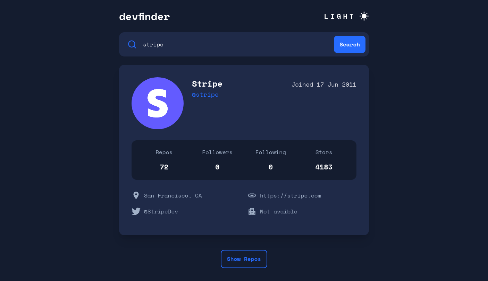

# React - GitHub User Search

  



## Sobre
Esse projeto foi criado com a biblioteca React JS e com os dados provenientes da [GitHub API](https://docs.github.com/pt/rest). Trata-se de uma página para pesquisa de usuários do GitHub. As buscas bem sucedidas retornam um quadro com informações do usuário e dos respectivos repositórios.

O design e layout foram baseados [nesse desafio](https://www.frontendmentor.io/challenges/github-user-search-app-Q09YOgaH6) do site Frontend Mentor.

[Link de acesso](https://leottx.github.io/react-github-user-search/) 🔗

## Instalação

Caso queira incrementar esse projeto, siga os passos abaixo:

```
git clone https://github.com/leottx/react-github-user-search.git
```

ou

1. Faça o fork desse repositório
2. Crie um branch `git checkout -b <nome-do-branch>`
3. Crie suas modificações e confirme-as: `git commit -m '<mensagem-commit>`
